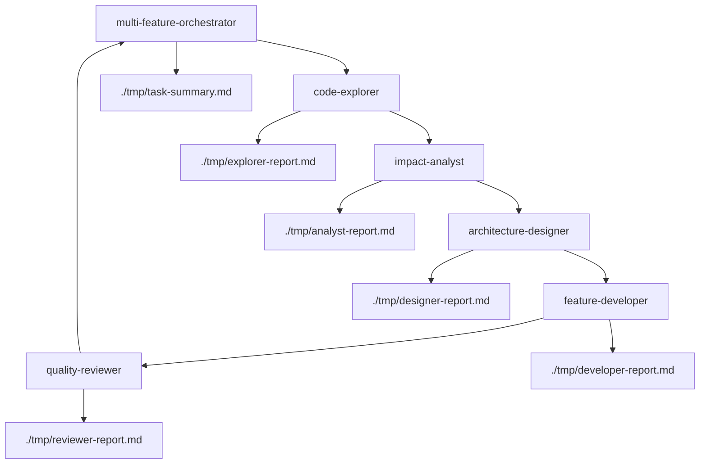

# Multi-Feature Development Agents Design

Claude Codeの`/agents`機能を使用した役割進化型ワークフローの実装設計

## 概要

`multi-feature.md`の役割進化型ワークフローを、Claude Codeの`/agents`機能（Task tool）を活用した専門subagentシステムに移植します。各フェーズを専門agentが担当し、オーケストレーターがワークフロー全体を管理します。

## Subagent定義

### 1. code-explorer (コード探索エージェント)

**責任範囲**: 既存コードベースの調査と要件の明確化

**利用可能ツール**: 
- Task, Bash, Glob, Grep, LS, Read, Edit, MultiEdit, Write, WebFetch, WebSearch

**専門機能**:
- 関連する既存コードの包括的調査
- 実装パターンとアーキテクチャの理解
- 要件と制約事項の明確化
- 影響を受けるファイル・モジュールの特定
- 技術スタックと依存関係の分析

**成果物**: `./tmp/{timestamp}-explorer-report.md`

**使用例**:
```markdown
/agents code-explorer "ユーザー認証機能に関連する既存実装を調査し、新しい機能追加に必要な要件と制約事項を明確化してください"
```

### 2. impact-analyst (影響分析エージェント)

**責任範囲**: 影響範囲の分析とリスク評価

**利用可能ツール**: 
- Task, Bash, Glob, Grep, LS, Read, WebFetch, WebSearch

**専門機能**:
- モジュール間依存関係の分析
- 技術的・スケジュールリスクの評価
- 実装複雑度の見積もり
- 段階的実装戦略の提案
- 後方互換性の検証

**成果物**: `./tmp/{timestamp}-analyst-report.md`

**前提条件**: code-explorerの調査結果を参照

**使用例**:
```markdown
/agents impact-analyst "code-explorerの調査結果を基に、新機能実装の影響範囲とリスクを分析し、最適な実装戦略を提案してください"
```

### 3. architecture-designer (アーキテクチャ設計エージェント)

**責任範囲**: システム設計とインターフェース定義

**利用可能ツール**: 
- Task, Read, Write, Edit, MultiEdit, WebFetch, mcp__context7__resolve-library-id, mcp__context7__get-library-docs

**専門機能**:
- システムアーキテクチャの設計
- APIインターフェースの定義
- データモデルの設計
- テスト戦略の策定
- 設計原則（KISS, DRY, SOLID）の適用

**成果物**: `./tmp/{timestamp}-designer-report.md`

**前提条件**: impact-analystの分析結果を参照

**使用例**:
```markdown
/agents architecture-designer "impact-analystの戦略提案を基に、新機能の詳細なアーキテクチャ設計とAPIインターフェースを定義してください"
```

### 4. feature-developer (機能開発エージェント)

**責任範囲**: TDD実装とコード作成

**利用可能ツール**: 
- Task, Bash, Glob, Grep, LS, Read, Edit, MultiEdit, Write, mcp__ide__getDiagnostics, mcp__ide__executeCode

**専門機能**:
- テストファースト開発（TDD）
- 実装コードの作成
- ユニットテストの作成
- 段階的コミット戦略
- 品質チェック（Lint/Format/Test/Build）の実行

**成果物**: `./tmp/{timestamp}-developer-report.md`

**前提条件**: architecture-designerの設計仕様を参照

**使用例**:
```markdown
/agents feature-developer "architecture-designerの設計仕様に基づいて、TDDアプローチで新機能を実装し、必要なテストも作成してください"
```

### 5. quality-reviewer (品質レビューエージェント)

**責任範囲**: コード品質確認と最終調整

**利用可能ツール**: 
- Task, Bash, Glob, Grep, LS, Read, Edit, MultiEdit, mcp__ide__getDiagnostics

**専門機能**:
- コードレビュー（セルフレビュー）
- テスト実行と結果確認
- ドキュメント品質チェック
- 改善提案の作成
- 最終品質ゲートの確認

**成果物**: `./tmp/{timestamp}-reviewer-report.md`

**前提条件**: feature-developerの実装結果を参照

**使用例**:
```markdown
/agents quality-reviewer "feature-developerの実装結果をレビューし、品質チェックを実行して最終的な改善提案を作成してください"
```

## オーケストレーター設計

### multi-feature-orchestrator (マルチ機能開発オーケストレーター)

**責任範囲**: 全体ワークフローの管理と調整

**利用可能ツール**: 
- Task (subagent起動), Bash, Read, Write, Edit, TodoWrite

**オーケストレーション機能**:
- ワークフロー全体の管理
- 各subagentの順次実行
- 成果物の統合と管理
- 進捗状況の追跡
- エラーハンドリングと回復処理
- 最終サマリーの生成

**実行フロー**:
```markdown
1. 環境検証と初期化
2. code-explorer起動 → 調査結果取得
3. impact-analyst起動 → 分析結果取得  
4. architecture-designer起動 → 設計結果取得
5. feature-developer起動 → 実装結果取得
6. quality-reviewer起動 → レビュー結果取得
7. 成果物統合とサマリー生成
8. クリーンアップ処理
```

## Agent間のデータフロー



## 実装における注意点

### 1. 状態管理
- 各agentは前のagentの成果物を読み込み可能
- `./tmp/`ディレクトリでの成果物管理
- タイムスタンプ付きファイル名での履歴管理

### 2. エラーハンドリング
- 各agentでの失敗時の回復処理
- 品質チェック失敗時の再実行機能
- 途中断時の再開機能

### 3. 品質ゲート
- 必須チェック: Lint → Format → Test → Build
- すべてパスするまで完了と認めない
- プロジェクトタイプ別の適切なコマンド使用

### 4. パフォーマンス最適化
- 必要な場合のみagentを起動
- 成果物の効率的な受け渡し
- 並列実行可能な部分の特定

## 使用例

### 基本的な使用方法
```markdown
/agents multi-feature-orchestrator "ユーザープロフィール画像アップロード機能を実装してください"
```

### オプション付き実行
```markdown
/agents multi-feature-orchestrator "認証トークンの有効期限チェック機能を追加してください。既存のセキュリティモジュールとの整合性を重視し、TDDアプローチで実装してください"
```

## 従来システムとの比較

| 機能 | 従来版(multi-feature.md) | Agents版 |
|------|-------------------------|----------|
| 実行環境 | 単一セッション、役割切替 | 専門agent、並列可能 |
| 専門性 | 汎用的な役割定義 | 高度に特化されたagent |
| 拡張性 | 限定的 | 高い（新agentの追加容易） |
| 再利用性 | ワークフロー固有 | agent単位での再利用可能 |
| デバッグ性 | 難しい | agent単位での独立デバッグ |
| 学習コスト | 中程度 | 低い（Claude標準機能） |

## 今後の拡張可能性

### 追加agentのアイディア
- **security-auditor**: セキュリティ監査専門
- **performance-optimizer**: パフォーマンス最適化専門  
- **documentation-writer**: ドキュメント作成専門
- **integration-tester**: 統合テスト専門
- **deployment-preparer**: デプロイ準備専門

### 特殊機能
- **parallel-execution**: 独立したagentの並列実行
- **conditional-workflow**: 条件分岐によるワークフロー変更
- **rollback-mechanism**: 失敗時の自動ロールバック
- **continuous-monitoring**: 実行中の継続的品質監視